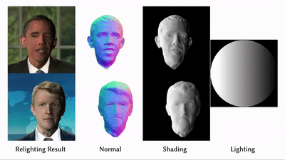
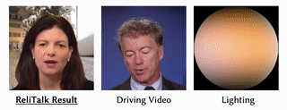

# ReliTalk - Drive any portrait with only a single training video required

## [**[Project Page]**](http://haonanqiu.com/projects/ReliTalk.html) | [**[Paper]**](https://arxiv.org/abs/2309.02434) | [**[Demo Video]**](https://www.youtube.com/watch?v=tS2Tek_72J0)

This repository provides the official PyTorch implementation for the following paper:

**ReliTalk: Relightable Talking Portrait Generation from a Single Video**</br>
[Haonan Qiu](http://haonanqiu.com/), [Zhaoxi Chen](https://frozenburning.github.io), [Yuming Jiang](https://yumingj.github.io/), [Hang Zhou](https://hangz-nju-cuhk.github.io/), [Wayne Wu](https://wywu.github.io/), [Xiangyu Fan](https://github.com/arthur-qiu/ReliTalk), [Lei Yang](https://scholar.google.com.hk/citations?user=jZH2IPYAAAAJ&hl=en), and [Ziwei Liu](https://liuziwei7.github.io/)</br>

From [MMLab@NTU](https://www.mmlab-ntu.com/index.html) affiliated with S-Lab, Nanyang Technological University and SenseTime Research.

## Generated Samples

### Relighting with rotated single lighting source.



### Relightable audio-driven talking portrait generation.



## Datasets

Video Data: [HDTF](https://github.com/MRzzm/HDTF)

## Getting Started
* Clone this repo: `git clone --recursive git@github.com:arthur-qiu/ReliTalk.git`
* Create a conda environment `conda env create -f environment.yml` and activate `conda activate ReliTalk` 
* We use `libmise` to extract 3D meshes, build `libmise` by running `cd code; python setup.py install`
* Download [FLAME model](https://flame.is.tue.mpg.de/download.php), choose **FLAME 2020** and unzip it, copy 'generic_model.pkl' into `./code/flame/FLAME2020`

## Preparing Dataset

Prepare the dataset following intructions in `./preprocess/README.md`.

Link the dataset folder to `./data/datasets`. Link the experiment output folder to `./data/experiments`.

## Relighting

### Train for rough normal

```bash
cd code
python scripts/exp_runner.py --conf ./confs/IMavatar_supervised_Obama.conf
```

### Generate rough normal
```bash
python scripts/exp_runner.py --conf ./confs/IMavatar_supervised_Obama_test.conf --is_eval --checkpoint [epoch1]
```

### Train for reflectance decomposition

```bash
mv ../data/experiments/Obama/IMavatar/Obama_train/eval/Obama_eval/epoch_[epoch1]/normal ../data/datasets/Obama/Obama/Obama_eval/

mv ../data/experiments/Obama/IMavatar/Obama_train/eval/Obama_train/epoch_[epoch1]/normal ../data/datasets/Obama/Obama/Obama_train/

mv ../data/experiments/Obama ../data/experiments/Obama_store

python scripts/exp_runner_relight.py --conf ./confs/IMavatar_supervised_Obama_light.conf
```

### Inference for relighting
```bash
python scripts/exp_runner_relight.py --conf ./confs/IMavatar_supervised_Obama_test_light.conf --is_eval --checkpoint [epoch2]
```

## We are still working on organizing the code of the remaining functions. 

## Citation

If you find this work useful for your research, please consider citing our paper:

```bibtex
@misc{qiu2023relitalk,
      title={ReliTalk: Relightable Talking Portrait Generation from a Single Video}, 
      author={Haonan Qiu and Zhaoxi Chen and Yuming Jiang and Hang Zhou and Xiangyu Fan and Lei Yang and Wayne Wu and Ziwei Liu},
      year={2023},
      eprint={2309.02434},
      archivePrefix={arXiv},
      primaryClass={cs.CV}
}
```

## Acknowledgments
This code borrows heavily from [IMavatar](https://github.com/zhengyuf/IMavatar).
